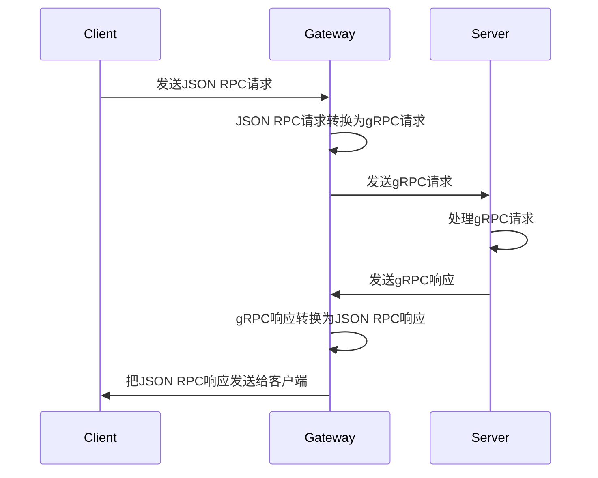
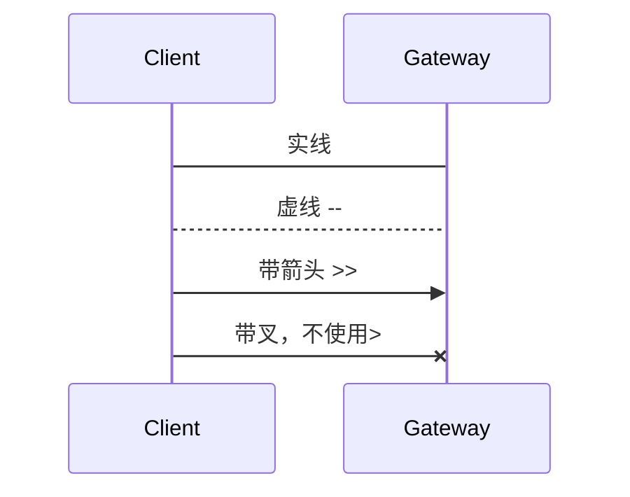
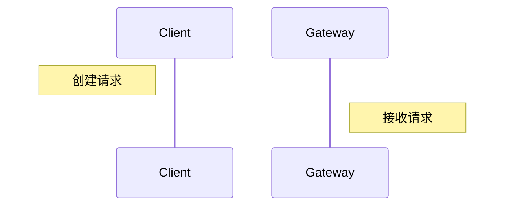
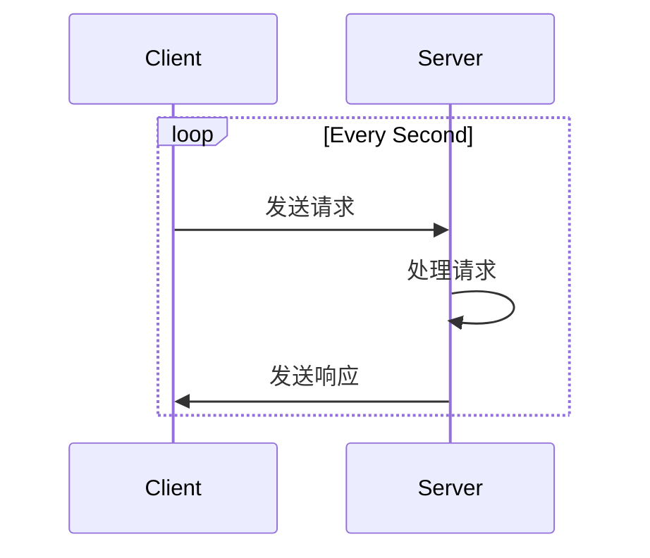
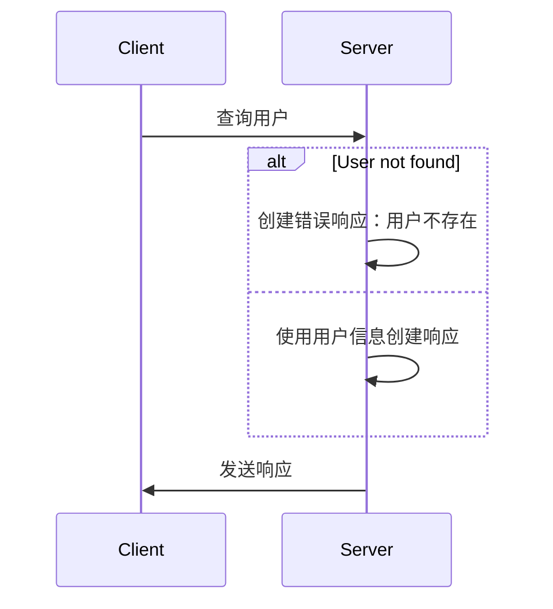
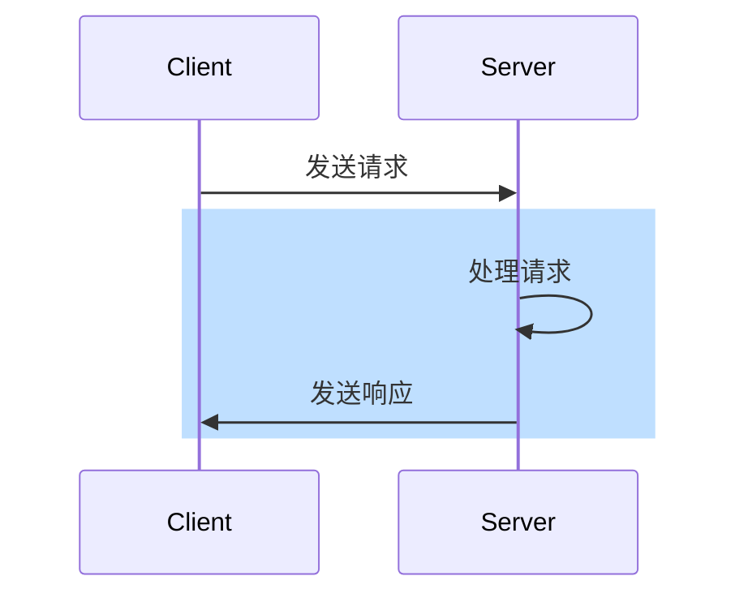
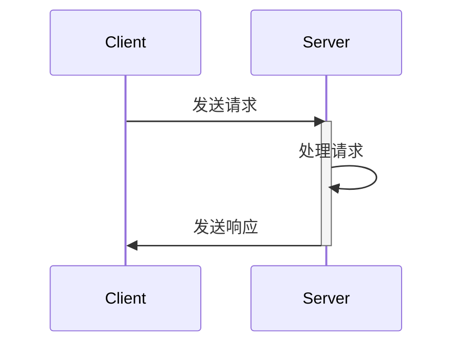
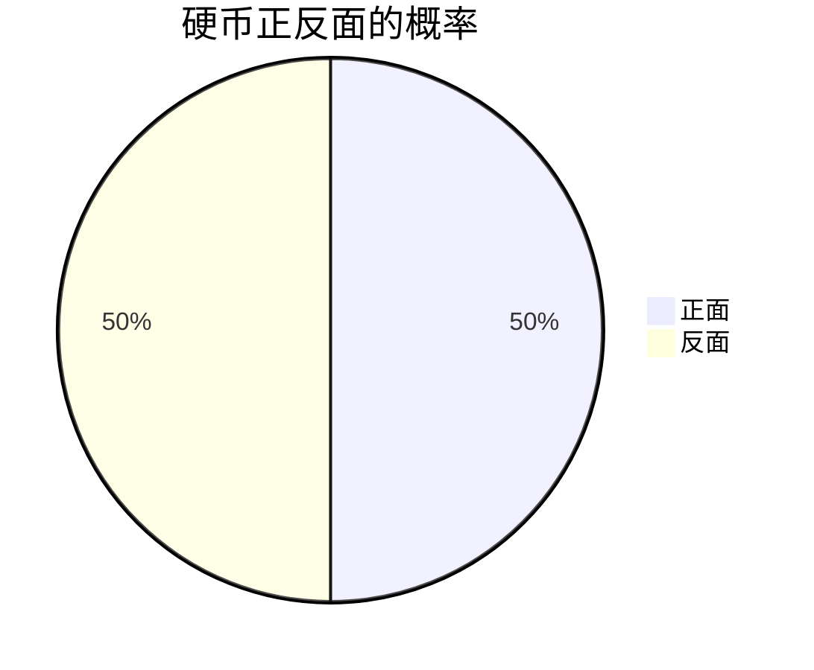

[mermaid](https://mermaid-js.github.io/mermaid/#/README)是一个开源项目，可以在Markdown中，使用类似编写代码的方式，制作流程图、时序图、甘特图、饼图等。使用下来，感觉可以明显提升时序图的效率。


### 时序图

#### 示例

```
sequenceDiagram
    %% 注释
    Client ->> Gateway: 发送JSON RPC请求
    Gateway ->> Gateway: JSON RPC请求转换为gRPC请求
    Gateway ->> Server: 发送gRPC请求
    Server ->> Server: 处理gRPC请求
    Server ->> Gateway: 发送gRPC响应
    Gateway ->> Gateway: gRPC响应转换为JSON RPC响应
    Gateway ->> Client: 把JSON RPC响应发送给客户端
```



#### 昵称

```
sequenceDiagram
    participant C as Client
    participant G as Gateway
    participant S as Server

    C ->> G: 发送JSON RPC请求
    G ->> G: JSON RPC请求转换为gRPC请求
    G ->> S: 发送gRPC请求
    S ->> S: 处理gRPC请求
    S ->> G: 发送gRPC响应
    G ->> G: gRPC响应转换为JSON RPC响应
    G ->> C: 把JSON RPC响应发送给客户端
```


#### 线条和箭头

```
sequenceDiagram
    Client -> Gateway: 实线
    Client --> Gateway: 虚线 --
    Client ->> Gateway: 带箭头 >>
    Client -x Gateway: 带叉，不使用>
```



#### 笔记

```
sequenceDiagram
    Note left of Client: 创建请求
    Note right of Gateway: 接收请求
```



#### 循环

```
sequenceDiagram
    loop Every Second
        Client ->> Server: 发送请求
        Server ->> Server: 处理请求
        Server ->> Client: 发送响应
    end
```



#### If语句

```
sequenceDiagram
    Client ->> Server: 查询用户
    alt User not found
        Server ->> Server: 创建错误响应：用户不存在
    else 
        Server ->> Server: 使用用户信息创建响应
    end
    Server ->> Client: 发送响应
```



#### 背景颜色

```
sequenceDiagram
    Client ->> Server: 发送请求
    rect rgb(191,223,255)
    Server ->> Server: 处理请求
    Server ->> Client: 发送响应
    end
```



#### 激活

```
sequenceDiagram
    Client ->> Server: 发送请求
    activate Server
    Server ->> Server: 处理请求
    Server ->> Client: 发送响应
    deactivate Server
```



### 饼图

```
pie
    title 硬币正反面的概率
    "正面": 0.5
    "反面": 0.5
```



